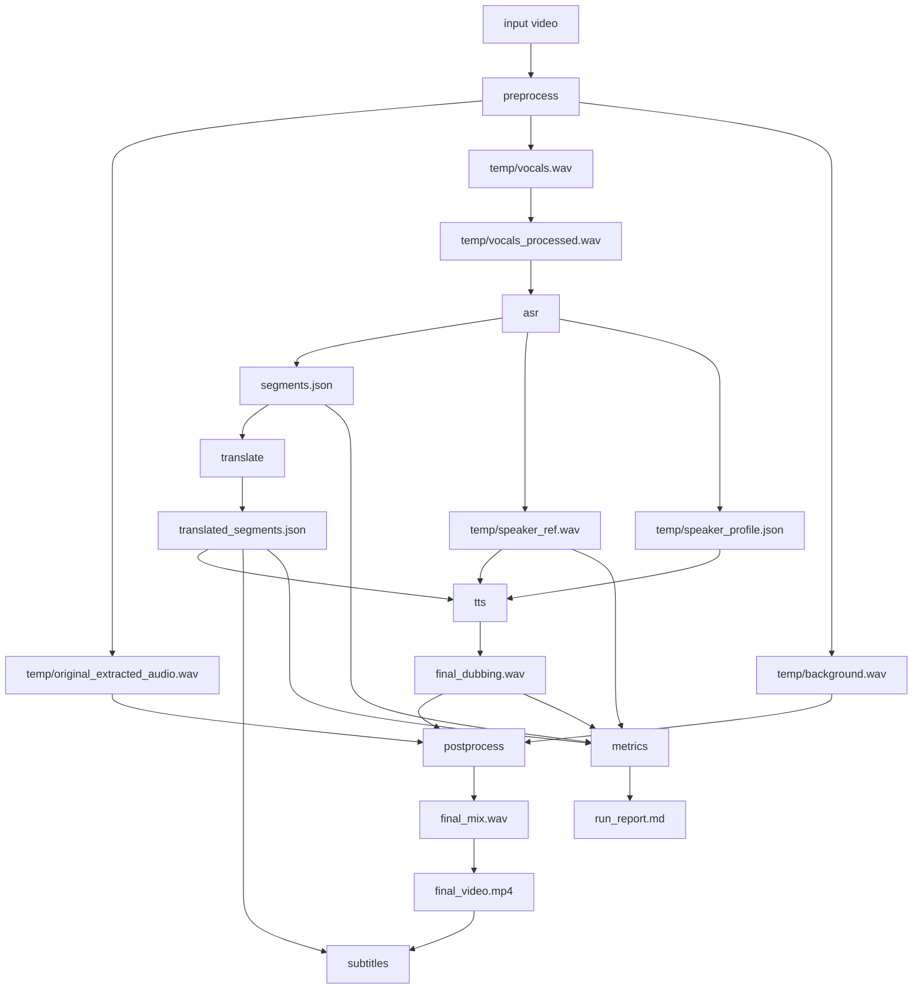

# Инженерная карта проекта

## 1. Назначение системы

Проект решает задачу автоматического дубляжа видео с сохранением голосовой идентичности исходного спикера:

1. извлекает аудио из исходного видео;
2. отделяет голос от фона;
3. распознает речь и режет ее на сегменты;
4. переводит сегменты на русский;
5. синтезирует новый голос в темпе, близком к исходному;
6. микширует дубляж с фоном и собирает финальное видео;
7. генерирует субтитры;
8. считает метрики качества.

Кодовая база остается исследовательской, но после стабилизации у нее уже есть воспроизводимый entrypoint, шаблон конфигурации, файл зависимостей, unit-тесты и единая структура артефактов по `job_name`.

## 2. Верхнеуровневая архитектура



Артефакты каждого запуска лежат в отдельной папке:

```text
data/output/<job-name>/
  segments.json
  translated_segments.json
  final_dubbing.wav
  final_mix.wav
  final_video.mp4
  tts_config.json
  metrics.json
  run_report.md
  subtitles/
  temp/
```

В тестовом режиме используется тот же layout внутри `data/test/<job-name>/`.

## 3. Карта модулей

### Точка входа

- `main.py`
  - Оркестрация шагов `preprocess`, `asr`, `translate`, `tts`, `postprocess`, `subtitles`, `metrics`, `prepare_finetune`.
  - Разрешение входного видео через `--video`, legacy `--suffix` или единственное видео в `data/input/`.
  - Построение путей через `utils/pipeline_io.py`.
  - Preflight-проверка окружения через `--check-env`.
  - Печать эффективной конфигурации через `--show-config` без запуска пайплайна.
  - Диагностика локальной готовности проекта через `--doctor`.
  - Resume-режим через `--resume` и принудительный пересчет через `--force-step`.
  - Snapshot TTS-настроек в `tts_config.json` и `metrics.json` перед генерацией `run_report.md`.

- `scripts/smoke_pipeline.py`
  - Запуск короткого `--test` smoke-run через `main.py --step all`.
  - Валидация ключевых артефактов, JSON-контрактов, subtitle manifest и метрик.
  - Режим `--skip-run` для быстрой проверки уже готовой папки `data/test/<job-name>/`.

- `scripts/benchmark_tts_profiles.py`
  - Сравнение TTS-профилей на одном подготовленном short job.
  - Профили: baseline, SmartSync on/off, segment matching on/off, babble guard on/off, XTTS conservative/expressive.
  - Для каждого профиля прогоняются `tts`, `postprocess`, `subtitles`, `metrics`; итог с метриками и TTS config snapshot пишется в `tts_benchmark_summary.md/.csv/.json`.

- `.github/workflows/unit.yml`
  - Быстрый CI-контур на push и pull request.
  - Ставит `requirements-ci.txt`, создает локальный `config.py` из `config.example.py`, компилирует ключевые entrypoints и запускает `tests/unit`.

### Конфигурация

- `config.example.py`
  - Шаблон локального `config.py`.
  - Пути, ASR/MT/TTS/SmartSync/subtitle/fine-tune параметры.
- `config.py`
  - Локальная конфигурация, не хранится в git.

### Доменные модули

- `src/preprocessing.py`
  - `ffmpeg` для извлечения аудио.
  - `demucs` для source separation.
  - `pydub` + `noisereduce` для подготовки вокала под ASR.

- `src/asr_backend.py`
  - Выбор ASR backend: локальный Whisper или Groq-compatible API.
  - Отдельные загрузчики для основного ASR и ASR в метриках.

- `src/asr.py`
  - Сегментация по словам и паузам.
  - Формирование `words`, `words_with_silence`, длительностей и пауз.
  - Создание `speaker_ref.wav`, `speaker_refs/` и `speaker_profile.json`.

- `src/translation.py`
  - NLLB и Gemini backend.
  - Стратегии `per-segment`, `sentence-level`, `sliding-window`, `context-aware`.
  - SmartSync rewrite backend для TTS.

- `src/tts.py`
  - XTTS synthesis orchestration.
  - SmartSync/TTS retry orchestration и финальная сборка сегментов.
  - Сериализация TTS-таймингов обратно в `translated_segments.json`.

- `src/tts_audio.py`
  - Оценка active speech dBFS.
  - Segment level matching и локальная подстройка target dBFS по source vocals.
  - Финальная компрессия и peak ceiling.

- `src/tts_guards.py`
  - Cheap tail guard и safe tail trim.
  - Babble guard и ASR retry scoring.
  - Общие recognition helpers для SmartSync и TTS retry.

- `src/tts_timing.py`
  - Расчет timing window для сегмента.
  - Оценка эффективной речевой длительности без краевых пауз.
  - Сдвиг следующего сегмента с учетом лимита.

- `src/tts_routing.py`
  - Оценка соответствия reference-клипа текущему сегменту.
  - Выбор per-segment reference paths из `speaker_profile`.

- `src/tts_text.py`
  - Text cleanup для TTS.
  - Построение retry-вариантов текста.
  - Grouping соседних TTS-сегментов.

- `src/tts_backends.py`
  - XTTS backend factory и backend wrapper.

- `src/postprocessing.py`
  - Наложение дубляжа на фон и оригинальную дорожку.
  - Сборка финального видео через `ffmpeg`.

- `src/subtitles.py`
  - Генерация `SRT`, `VTT`, `ASS`.
  - Soft/hard subtitle embedding.
  - Подключено в `main.py` как шаг `subtitles` и часть `all`.

- `src/metrics.py`
  - Speaker verification через `resemblyzer`.
  - WER/CER через ASR + `jiwer`.
  - Семантическое сходство перевода через LaBSE.

- `src/reporting.py`
  - Генерация `run_report.md` после шага `metrics`.
  - Сводка по сегментам, TTS grouping/guards, timing pressure, метрикам, TTS config snapshot и артефактам.

- `src/config_snapshot.py`
  - Сериализация фактических TTS-настроек запуска для `tts_config.json`, `metrics.json`, `run_report.md` и benchmark-сводок.
  - Snapshot всей безопасной runtime-конфигурации для `python main.py --show-config`.

- `src/doctor.py`
  - Быстрая диагностика `config.py`, входного видео, writable output/test директорий, XTTS-файлов, CLI, Python-зависимостей и API-key env-переменных.

### Утилиты

- `utils/pipeline_io.py`
  - `job_name` normalization.
  - Поиск входных видео.
  - Сборка путей `data/output/<job-name>/` и `data/test/<job-name>/`.

- `utils/pipeline_resume.py`
  - Контракты готовности артефактов для `--resume`.
  - Проверка JSON-артефактов, аудио/видео файлов и subtitle manifest.

- `utils/helpers.py`
  - Seed, управление директориями, очистка GPU-памяти, нормализация путей.

### Эксперименты и тесты

- `experiments/`
  - Offline benchmark-скрипты сравнения переводчиков и стратегий.
  - Это не unit-тесты и не должны запускаться как быстрый CI-контур.

- `tests/unit/`
  - Быстрые unit-тесты для ASR metadata, pipeline paths, subtitles, TTS serialization и вынесенных TTS helpers.

- `requirements-ci.txt`
  - Минимальные зависимости для GitHub Actions unit-контура без тяжелого ML runtime-стека.

## 4. Контракты между шагами

### `preprocess`

Вход:

- `--video <path>`;
- или единственное видео в `data/input/`;
- или legacy `data/input/video_<suffix>.<ext>`.

Выход:

- `temp/original_extracted_audio.wav`
- `temp/vocals.wav`
- `temp/background.wav`
- `temp/vocals_processed.wav`

### `asr`

Вход:

- `temp/vocals_processed.wav`

Выход:

- `segments.json`
- `temp/speaker_ref.wav`
- `temp/speaker_profile.json`
- `temp/speaker_refs/`

Контракт сегмента:

```json
{
  "text": "source text",
  "start": 12.34,
  "end": 15.67,
  "speaker_id": "spk_0",
  "words": [],
  "words_with_silence": [],
  "source_duration_sec": 3.33,
  "source_word_count": 5,
  "pause_before_sec": 0.2,
  "pause_after_sec": 0.4
}
```

### `translate`

Вход:

- `segments.json`

Выход:

- `translated_segments.json`

Контракт переведенного сегмента:

```json
{
  "text": "translated text",
  "original_text": "source text",
  "start": 12.34,
  "end": 15.67,
  "speaker_id": "spk_0"
}
```

Дополнительные поля могут появляться в зависимости от стратегии, например `merged_count`.

### `tts`

Вход:

- `translated_segments.json`
- `temp/speaker_ref.wav`
- опционально `temp/speaker_profile.json`

Выход:

- `final_dubbing.wav`
- обновленный `translated_segments.json` с TTS-таймингами;
- временные сегменты в `temp/audio_segments/`.

Важно: runtime-аудиообъекты не сериализуются; `_serialize_tts_segments` выкидывает `corrected_audio`.

### `postprocess`

Вход:

- `final_dubbing.wav`
- `temp/background.wav`
- `temp/original_extracted_audio.wav`

Выход:

- `final_mix.wav`
- `final_video.mp4`

### `subtitles`

Вход:

- `final_video.mp4`
- `translated_segments.json`

Выход:

- `subtitles/subtitles.srt`
- `subtitles/subtitles.vtt`
- `subtitles/subtitles.ass`
- `subtitles/subtitles_manifest.json`
- soft/hard video artifact в зависимости от `--subtitle-mode`.

### `metrics`

Вход:

- `temp/speaker_ref.wav`
- `final_dubbing.wav`
- `segments.json`
- `translated_segments.json`
- `tts_config.json` если уже был выполнен шаг `tts`.

Выход:

- `metrics.json`
- `run_report.md`
- печать сводки в stdout;
- график LaBSE через matplotlib.

## 5. Внешние зависимости

### Python

Основной список закреплен в `requirements.txt`: `torch`, `openai-whisper`, `transformers`, `TTS`, `demucs`, `soundfile`, `pydub`, `noisereduce`, `sentence-transformers`, `jiwer`, `resemblyzer`, `pytest` и сопутствующие библиотеки.

### System CLI

- `ffmpeg` в `PATH`;
- `demucs` CLI в активном Python-окружении.

### Local model files

`original_tts_model/` должен содержать минимум:

```text
config.json
model.pth
vocab.json
speakers_xtts.pth
```

## 6. Текущий статус стабилизации

Уже сделано:

- добавлен `README.md` с runbook;
- добавлен `requirements.txt`;
- добавлен `config.example.py`;
- добавлен `python main.py --check-env`;
- добавлен `python main.py --show-config`;
- добавлен `python main.py --doctor`;
- добавлен `python scripts/smoke_pipeline.py`;
- добавлен `python scripts/benchmark_tts_profiles.py`;
- добавлен `run_report.md` после шага `metrics`;
- добавлен snapshot TTS-настроек в `tts_config.json`, `metrics.json`, `run_report.md` и benchmark-сводки;
- добавлен GitHub Actions unit-контур через `requirements-ci.txt`;
- добавлен `--resume` и `--force-step` для пропуска уже готовых шагов;
- подключен шаг `subtitles`;
- введена структура `data/output/<job-name>/`;
- удалены tracked `__pycache__`;
- benchmark-скрипты перенесены в `experiments/`;
- быстрые тесты находятся в `tests/unit/`;
- TTS runtime-настройки сгруппированы в dataclass-конфиги;
- text cleanup/grouping вынесены из `src/tts.py` в `src/tts_text.py`;
- reference routing вынесен из `src/tts.py` в `src/tts_routing.py`;
- timing/window logic вынесена из `src/tts.py` в `src/tts_timing.py`;
- tail/babble guards вынесены из `src/tts.py` в `src/tts_guards.py`;
- audio level/compression helpers вынесены из `src/tts.py` в `src/tts_audio.py`;
- smoke-run на коротком видео был успешно пройден перед audio-refactor;
- smoke-run формализован как отдельный скрипт с проверкой артефактов;
- benchmark-инфраструктура TTS-профилей готова, baseline sanity-run пройден, полный прогон всех профилей отложен.

## 7. Текущие инженерные риски

### P1. `src/tts.py` слишком крупный

В одном файле все еще смешаны SmartSync, TTS retry и финальная сборка аудио. Настройки, text cleanup/grouping, reference routing, timing/window logic, guards и audio helpers уже вынесены отдельно, поэтому следующий безопасный шаг - продолжать дробление по зонам ответственности небольшими коммитами.

### P1. Мало интеграционных тестов вокруг TTS-контрактов

Есть тесты сериализации TTS-сегментов, text/grouping helpers, routing helpers, timing-window rules, guards, SmartSync acceptance gate, audio level/compression helpers, run reporting и smoke artifact validation. Следующий пробел - регулярный прогон smoke-check перед значимыми изменениями и интеграционные TTS-сценарии на коротком видео.

### P2. Полный benchmark TTS-профилей еще не собран

Инфраструктура уже есть в `scripts/benchmark_tts_profiles.py`: общий prep job, одинаковые upstream-артефакты, профили настроек и сводки `md/csv/json`. Следующий шаг не архитектурный, а качественный: прогнать все профили на одном коротком видео, прослушать спорные варианты и выбрать recommended TTS-настройки.

### P2. Vendor-мусор в репозитории

`vendor_latex2mathml/` и похожие большие локальные папки лучше чистить отдельным коммитом. Это репозиторная гигиена, а не изменение pipeline-кода.

### P2. Конфигурация пока глобальная

`main.py` читает `config.py` напрямую. TTS-настройки уже передаются как config-объекты, но общий подход к конфигурации пока остается глобальным.

## 8. Следующая программа работ

### Этап 1. TTS config refactor

Статус: выполнено.

1. Введены dataclass-конфиги:
   - `TTSRuntimeConfig`
   - `SmartSyncConfig`
   - `TailGuardConfig`
   - `SegmentRoutingConfig`
   - `AudioLevelConfig`
2. Эти объекты передаются из `main.py` в `synthesize_segments_with_timing`.
3. Алгоритмы TTS не менялись.

### Этап 2. Дробление `src/tts.py`

После dataclass-конфигов выносить блоки небольшими коммитами:

- text cleanup/grouping - выполнено, `src/tts_text.py`;
- reference routing - выполнено, `src/tts_routing.py`;
- timing/window logic - выполнено, `src/tts_timing.py`;
- tail/babble guards - выполнено, `src/tts_guards.py`;
- audio level/compression helpers - выполнено, `src/tts_audio.py`.

### Этап 3. Репозиторная чистка

Отдельно решить судьбу:

- `vendor_latex2mathml/`;
- крупных локальных папок;
- неиспользуемых черновиков, если они появятся в tracked-файлах.

### Этап 4. Benchmark качества TTS

Статус: инфраструктура выполнена, полный прогон отложен.

- [x] Добавить `scripts/benchmark_tts_profiles.py`.
- [x] Использовать один общий prep job для `preprocess`, `asr`, `translate`.
- [x] Сравнивать `baseline`, SmartSync on/off, segment matching on/off, babble guard on/off и XTTS conservative/expressive.
- [x] Писать итоговые `tts_benchmark_summary.md`, `tts_benchmark_summary.csv`, `tts_benchmark_summary.json`.
- [x] Проверить инфраструктуру baseline sanity-run на `smoke_20s.mp4`.
- [ ] Запустить полный benchmark всех профилей на `smoke_20s.mp4`.
- [ ] Прослушать лучшие и худшие профили по таблице метрик.
- [ ] Выбрать recommended TTS-профиль.
- [ ] Зафиксировать выбранные значения в документации или `config.example.py`.

### Этап 5. SmartSync safety tests

Статус: базовый acceptance-контур покрыт unit-тестами.

- [x] Проверить objective для `shorter` mode через `_smart_sync_distance_ms`.
- [x] Проверить acceptance rewrite при сохраненном смысле и хорошем ASR.
- [x] Проверить reject по низкому text similarity.
- [x] Проверить reject по низкому ASR score.
- [x] Проверить reject по сильному ASR drop от baseline.
- [x] Проверить reject по extra tail и missing suffix.
- [ ] Добавить интеграционный smoke-сценарий, где SmartSync реально срабатывает на коротком видео.

## 9. Практический вывод

Проект уже имеет рабочее ядро дубляжа, воспроизводимый запуск, базовые тесты, отдельный smoke-check и инструмент сравнения TTS-профилей. Основные TTS helper-зоны вынесены из `src/tts.py`; дальше разумнее улучшать качество запусков, отчеты и UX пайплайна, а не продолжать дробление ради дробления.
