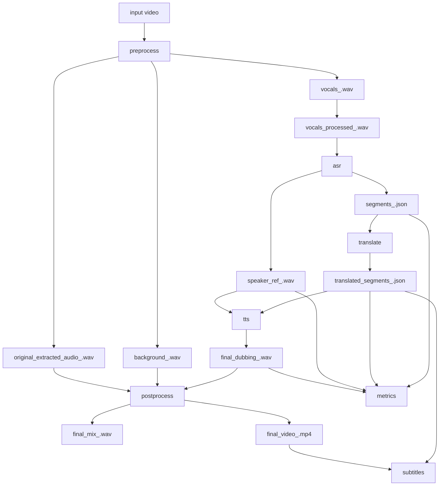

# Инженерная карта проекта

## 1. Назначение системы

Проект решает задачу автоматического дубляжа видео:

1. извлекает аудио из исходного видео;
2. отделяет голос от фона;
3. распознаёт речь и режет её на сегменты;
4. переводит сегменты на русский;
5. синтезирует новый голос в темпе, близком к исходному;
6. микширует дубляж с фоном и собирает финальное видео;
7. считает метрики качества;
8. опционально умеет генерировать и встраивать субтитры.

Текущая кодовая база ближе к исследовательскому проекту, чем к оформленному production-пакету. Основная ценность уже есть в реализованном пайплайне и накопленных артефактах экспериментов.

Актуальный интерфейс запуска уже не требует обязательного `suffix`: пайплайн умеет брать явный `--video` и формировать артефакты по `job_name`, сохраняя `--suffix` только как legacy-режим.

## 2. Верхнеуровневая архитектура



## 3. Карта модулей

### Точка входа

- `main.py`
  - Оркестрация шагов пайплайна.
  - Построение путей артефактов.
  - Проверка обязательных файлов между шагами.
  - Загрузка тяжёлых моделей прямо внутри шагов.
  - Текущий production entrypoint.

### Конфигурация

- `config.py`
  - Глобальные константы проекта.
  - Пути до входов/выходов и моделей.
  - Параметры ASR, MT, TTS, микширования и финетюна.

### Доменные модули

- `src/preprocessing.py`
  - `ffmpeg` для извлечения аудио.
  - `demucs` для source separation.
  - `pydub` + `noisereduce` для подготовки аудио под Whisper.

- `src/asr.py`
  - Вызов Whisper.
  - Сегментация по паузам между словами.
  - Выбор референсного фрагмента голоса.

- `src/translation.py`
  - Общая батчевая обёртка над `transformers.generate`.
  - Четыре стратегии перевода:
    - `translate_segments`
    - `translate_segments_as_sentences`
    - `translate_segments_sliding_window`
    - `translate_segments_with_context`
  - В `main.py` сейчас используется `translate_segments_with_context`.

- `src/tts.py`
  - Синтез отдельных сегментов через XTTS.
  - Предвычисление conditioning latents.
  - Подгонка длительности через ускорение.
  - Тайминговая сборка итоговой озвучки.

- `src/postprocessing.py`
  - Наложение дубляжа на фон и оригинальную дорожку.
  - Сборка финального видео через `ffmpeg`.

- `src/metrics.py`
  - Speaker verification через `resemblyzer`.
  - WER/CER через Whisper + `jiwer`.
  - Семантическое сходство перевода через LaBSE.

- `src/subtitles.py`
  - Генерация `SRT`, `VTT`, `ASS`.
  - Встраивание мягких и прожжённых субтитров в видео.
  - Функциональность реализована полноценно, но не подключена в основном `main.py`.

### Утилиты

- `utils/helpers.py`
  - Seed.
  - Управление директориями.
  - Очистка GPU-памяти.
  - Нормализация путей.

### Эксперименты и исследовательские скрипты

- `tests/test_translation.py`
  - Сравнение стратегий перевода.
- `tests/test_translation_models.py`
  - Сравнение NLLB-600M и NLLB-1.3B.
- `tests/test_google_translate.py`
  - Сравнение против Google Translate baseline.

Важно: это не unit/integration tests, а офлайн-скрипты для экспериментов.

### Артефакты и черновики

- `final.ipynb`
  - Исследовательский ноутбук и, вероятно, исходный источник логики проекта.
- `mainSubs`
  - Черновой альтернативный entrypoint с шагом субтитров.
  - В текущем состоянии файл битый и не должен считаться рабочим.
- `test.py`
  - Случайный черновой файл, инженерной ценности не несёт.

## 4. Контракты между шагами

### `preprocess`

Вход:

- `data/input/video_<suffix>.mp4`
- или произвольный путь, переданный через `--video`

Выход:

- `data/<mode>/temp/original_extracted_audio_<job>.wav`
- `data/<mode>/temp/vocals_<job>.wav`
- `data/<mode>/temp/background_<job>.wav`
- `data/<mode>/temp/vocals_processed_<job>.wav`

### `asr`

Вход:

- `vocals_processed_<job>.wav`

Выход:

- `segments_<job>.json`
- `speaker_ref_<job>.wav`

Контракт сегмента:

```json
{
  "text": "source text",
  "start": 12.34,
  "end": 15.67,
  "speaker_id": "spk_0"
}
```

### `translate`

Вход:

- `segments_<job>.json`

Выход:

- `translated_segments_<job>.json`

Контракт переведённого сегмента:

```json
{
  "text": "translated text",
  "original_text": "source text",
  "start": 12.34,
  "end": 15.67,
  "speaker_id": "spk_0"
}
```

Дополнительные поля могут появляться в зависимости от стратегии, например `merged_count`.

`speaker_id` уже зарезервирован в схеме для будущей диаризации, хотя текущий runtime всё ещё single-speaker.

### `tts`

Вход:

- `translated_segments_<job>.json`
- `speaker_ref_<job>.wav`

Выход:

- `final_dubbing_<job>.wav`
- набор временных `seg_<ts>.wav` в `audio_segments/`

Важная особенность:

- `src/tts.py` мутирует сегменты in-place, добавляя поля вроде `original_start`, `cleaned_text`, `corrected_audio`, `corrected_duration_sec`.

### `postprocess`

Вход:

- `final_dubbing_<job>.wav`
- `background_<job>.wav`
- `original_extracted_audio_<job>.wav`

Выход:

- `final_mix_<job>.wav`
- `final_video_<job>.mp4`

### `metrics`

Вход:

- `speaker_ref_<job>.wav`
- `final_dubbing_<job>.wav`
- `segments_<job>.json`
- `translated_segments_<job>.json`

Выход:

- печать метрик в stdout;
- график LaBSE через matplotlib.

### `subtitles`

Реализовано в `src/subtitles.py`, но в основном `main.py` не подключено.

## 5. Карта данных и директорий

### Исходные данные

- `data/input/`
  - исходные видео
  - в legacy-режиме допустим шаблон `video_<suffix>.mp4`

### Основные результаты

- `data/output/`
  - финальные аудио/видео production-режима
- `data/output/temp/`
  - промежуточные wav-артефакты
  - сегменты TTS
  - хвосты Demucs

### Тестовые и экспериментальные результаты

- `data/test/`
  - сегменты
  - переводы разными моделями и стратегиями
  - графики и JSON со сводками LaBSE

### Модели

- `original_tts_model/`
  - фактически лежащая XTTS-модель

## 6. Внешние зависимости

### Python-библиотеки

- `torch`
- `openai-whisper`
- `transformers`
- `TTS`
- `soundfile`
- `pydub`
- `noisereduce`
- `scipy`
- `numpy`
- `matplotlib`
- `tqdm`
- `sentence-transformers`
- `scikit-learn`
- `jiwer`
- `resemblyzer`
- `googletrans` для baseline-скрипта

### Системные зависимости

- `ffmpeg` в `PATH`
- `demucs` CLI в `PATH`

### Аппаратное ускорение

- GPU опциональна, но под большие модели и XTTS практически нужна.

### Текущая проблема упаковки

В проекте нет `requirements.txt`, `pyproject.toml` или другого официального манифеста зависимостей.

## 7. Зафиксированные результаты экспериментов

По сохранённым JSON в `data/test/`:

- `sliding-window` показал слабый результат и не должен быть кандидатом на default.
  - `LaBSE mean ≈ 0.5446`
- `nllb-600M per-segment` и `sentence-level` близки по качеству.
  - `≈ 0.8609` и `≈ 0.8590`
- лучшая сохранённая офлайн-конфигурация:
  - `nllb-1.3B × per-segment`
  - `LaBSE mean ≈ 0.8732`
- `Google Translate` baseline оказался сильнее `nllb-600M`, но чуть слабее `nllb-1.3B per-segment`.
  - `LaBSE mean ≈ 0.8715`

Инженерный вывод:

- исторически лучший зафиксированный выбор перевода в артефактах не совпадает с текущим production-дефолтом в `main.py`, где используется `translate_segments_with_context`.

## 8. Текущие инженерные риски

### P0. Пайплайн не воспроизводится из коробки

- В проекте по-прежнему нет описанного и автоматизированного способа поднять окружение.
- Даже после исправления пути к XTTS-модели запуск всё ещё зависит от ручной установки Python-библиотек и системных CLI.

### P0. Нет официального способа поднять окружение

- Нет файла зависимостей.
- Нет README с порядком установки `ffmpeg`, `demucs`, XTTS и Python-библиотек.

### P1. Разрыв между основным кодом и модулем субтитров

- `src/subtitles.py` готов к использованию.
- `main.py` не знает о шаге `subtitles`.
- `mainSubs` содержит нужную логику, но файл испорчен посторонним текстом и не должен использоваться как источник истины.

### P1. Экспериментальный код смешан с рабочим

- В репозитории одновременно лежат production entrypoint, ноутбук, битый альтернативный entrypoint, исследовательские скрипты и случайные файлы.
- Это повышает стоимость сопровождения и риск запуска не того сценария.

### P1. Нет автоматических тестов на критичные контракты

- Не покрыты:
  - формат сегментов;
  - сегментация по паузам;
  - корректность путей;
  - сборка команд `ffmpeg` и `demucs`;
  - правила разбиения перевода по чанкам;
  - тайминговая сборка TTS.

### P1. Промежуточные артефакты неполны

- В `data/output/` лежат финальные `wav/mp4`, но отсутствуют `segments_*.json` и `translated_segments_*.json`.
- Это ломает повторный запуск отдельных шагов, особенно `metrics`, `translate`, `tts`.

### P2. Избыточная связанность модулей

- Тяжёлые зависимости и глобальный конфиг жёстко встроены в runtime-логику.
- Шаги сложно тестировать отдельно без моков и файловой системы.

### P2. Нестабильные побочные эффекты

- `src/tts.py` изменяет входной список сегментов по месту.
- `src/preprocessing.py` использует `os.rename` для перемещения файлов Demucs, что хрупко при повторных прогонах и переносах.

## 9. Рекомендуемая инженерная программа работ

### Этап 1. Сделать проект воспроизводимым

1. Добавить `requirements.txt` или `pyproject.toml`.
2. Добавить `README.md` с минимальным runbook:
   - установка зависимостей;
   - установка `ffmpeg`;
   - установка `demucs`;
   - подготовка модели XTTS;
   - пример запуска по шагам.
3. Добавить preflight-проверку окружения перед запуском пайплайна.

### Этап 2. Вычистить структуру репозитория

1. Оставить один официальный entrypoint.
2. Удалить или архивировать `mainSubs`.
3. Перенести исследовательские скрипты из `tests/` в `experiments/` или `research/`.
4. Убрать случайные черновики вроде `test.py`.

### Этап 3. Зафиксировать архитектурные контракты

1. Выделить схемы артефактов `segments` и `translated_segments`.
2. Добавить валидацию JSON перед каждым следующим шагом.
3. Сделать явную модель состояния пайплайна: что уже готово, что отсутствует, что может быть переиспользовано.

### Этап 4. Принять техническое решение по переводу

1. Формально выбрать default-стратегию перевода.
2. Сверить текущий `context-aware` с сохранёнными экспериментами.
3. Либо оставить его и доизмерить, либо переключить production default на лучший зафиксированный вариант.

### Этап 5. Добавить реальные тесты

1. Unit-тесты для:
   - сегментации пауз;
   - chunking/merge логики перевода;
   - генерации subtitle-файлов;
   - build_paths/check_file.
2. Интеграционный dry-run test без тяжёлых моделей.
3. Smoke-test на одном коротком аудио/видео-файле.

## 10. Рекомендованное целевое устройство репозитория

```text
project/
  README.md
  requirements.txt
  config.py
  main.py
  src/
    preprocessing.py
    asr.py
    translation.py
    tts.py
    postprocessing.py
    subtitles.py
    metrics.py
  tests/
    unit/
    integration/
  experiments/
    compare_translation_strategies.py
    compare_models.py
    compare_google_baseline.py
  data/
    input/
    output/
    test/
  models/
    original_tts/
```

## 11. Практический вывод

Проект уже содержит рабочее ядро дубляжа и полезные результаты экспериментов. Главная инженерная проблема не в отсутствии функциональности, а в том, что код ещё не доведён до воспроизводимого и однозначного состояния.

Кратко:

- ядро пайплайна есть;
- структура модулей в целом разумная;
- результаты экспериментов сохранены;
- основной долг лежит в упаковке, воспроизводимости, выборе дефолтной стратегии перевода и очистке репозитория от исследовательских артефактов.
