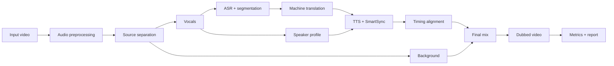

# Automatic Video Dubbing with Voice Identity Preservation

Публичный репозиторий выпускной квалификационной работы по автоматическому дубляжу видео с английского языка на русский с сохранением голосовой идентичности диктора и временной синхронизацией реплик.

Репозиторий содержит основной Python-код пайплайна, API/desktop-обёртки, тесты, примеры конфигурации, описание архитектуры, ключевые результаты и демонстрационный пример. Не публикуются API-ключи, локальный `config.py`, веса моделей, входные датасеты, рабочие артефакты запусков и дипломные черновики.

## Что опубликовано

В публичной версии оставлены материалы, достаточные для изучения архитектуры и запуска прототипа при наличии зависимостей, моделей или API-доступа:

- основной код пайплайна в `main.py`, `src/` и `utils/`;
- HTTP API, desktop wrapper и web UI в `api/`, `desktop/` и `web/`;
- тесты и CI-конфигурация в `tests/` и `.github/`;
- примеры конфигурации: `config.example.py`, `.env.example`, `translation_profiles.yaml`;
- инструкции по установке и запуску в `INSTALL.md`;
- демонстрационная пара видео в `media/`;
- основные численные результаты и ограничения работы.

Для полного запуска нужны внешние зависимости: FFmpeg, Demucs/Whisper или совместимые API, TTS-backend, а также локальные модели или ключи провайдеров. Они подключаются через переменные окружения и не хранятся в репозитории.

## Демонстрация

| Файл | Описание |
|---|---|
| [`media/original_en_machine_learning_100s.mp4`](media/original_en_machine_learning_100s.mp4) | исходный англоязычный ролик |
| [`media/dubbed_ru_machine_learning_100s.mp4`](media/dubbed_ru_machine_learning_100s.mp4) | автоматически сгенерированный русскоязычный дубляж |


## Идея проекта

Обычная схема автоматического дубляжа часто сводится к последовательности независимых шагов: распознать речь, перевести текст, синтезировать новую дорожку. На практике этого недостаточно. Даже если перевод смыслово корректен, он может не помещаться во временное окно исходной реплики. Даже если синтез звучит качественно, голос может быть не похож на исходного диктора. Даже если голос похож, итоговая дорожка может плохо распознаваться или конфликтовать с фоном.

Поэтому проект рассматривает автоматический дубляж как многокритериальную задачу, где итоговое качество определяется не одним компонентом, а согласованием нескольких ограничений:

- сохранение смысла исходной речи;
- сохранение голосовой идентичности диктора;
- попадание синтезированной реплики в исходные временные окна;
- разборчивость и акустическая устойчивость итоговой речи;
- воспроизводимость экспериментов через сохранение промежуточных артефактов.

Цель работы - разработать систему, которая принимает исходный видеоролик, автоматически формирует русскоязычную речевую дорожку, сохраняет видеоряд и фон, синхронизирует результат с исходным таймингом и позволяет количественно оценить качество.

## Общая архитектура



Система построена как каскадный пайплайн. Каждый этап сохраняет промежуточные файлы, поэтому отдельные компоненты можно сравнивать без полного пересчёта всего процесса.

Основные этапы:

1. **Предобработка видео и аудио.** Из исходного видео извлекается аудиодорожка, затем речь отделяется от фоновых звуков.
2. **ASR и сегментация.** Речь распознаётся с временными метками слов; на их основе строятся сегменты для перевода и синтеза.
3. **Построение голосового профиля.** Из исходной речи выбираются референсные фрагменты, по которым TTS-система воспроизводит голос диктора.
4. **Машинный перевод.** Английские сегменты переводятся на русский язык с учётом контекста.
5. **TTS и SmartSync.** Русский текст синтезируется голосом исходного диктора; проблемные реплики адаптируются под доступное временное окно.
6. **Постобработка.** Синтезированная речь нормализуется, размещается на временной шкале и смешивается с фоновой дорожкой.
7. **Оценка качества.** Система считает метрики смысловой близости, разборчивости и голосового сходства.

## Основные модули

| Модуль | Назначение |
|---|---|
| `preprocessing` | извлечение аудио из видео, разделение речи и фона, подготовка речевой дорожки для ASR |
| `asr` | распознавание речи, получение word-level timestamp, построение сегментов и выбор голосовых референсов |
| `translation` | перевод сегментов с учётом границ предложений и подготовка кандидатов для SmartSync |
| `tts` | синтез русской речи, выбор референсов, сегментный routing и контроль длительности |
| `postprocessing` | размещение реплик на временной шкале, настройка громкости, микширование речи, фона и тихой исходной дорожки |
| `metrics` | расчёт WER/CER, семантической близости, голосового сходства и показателей синхронизации |

## Актуальная конфигурация

В финальной экспериментальной серии использовалась online-конфигурация:

- `Whisper small` для ASR и word-level timestamp;
- `RouterAI` как OpenAI-compatible backend;
- модель `gpt-5.4-mini` для машинного перевода и SmartSync;
- стратегия перевода `sentence-boundary-aware`;
- `ElevenLabs Instant Voice Cloning` для синтеза речи с сохранением голосовой идентичности;
- `FFmpeg` и `HTDemucs` для извлечения, разделения, микширования и сборки аудио/видео.

Локальный fallback также рассматривался: локальный ASR/MT и `XTTS-v2`. Такой режим сохраняет автономность, но качество и скорость сильнее зависят от видеопамяти, локальной модели и качества референсов.

## Sentence-boundary-aware translation

Одна из проблем дубляжа состоит в том, что ASR-сегменты не всегда совпадают с предложениями. Если переводить каждый сегмент отдельно, модель теряет контекст. Если переводить целое предложение, затем приходится обратно делить перевод на исходные временные окна, и это может разрушить синхронизацию.

В проекте используется промежуточная стратегия `sentence-boundary-aware`:

1. соседние ASR-сегменты группируются до границы предложения;
2. модель получает контекст полного предложения;
3. модель сразу возвращает перевод в исходные сегментные окна;
4. число выходных переводов должно совпадать с числом входных сегментов.

Такой подход сохраняет контекст предложения, но не ломает сегментную структуру, необходимую для TTS и временной синхронизации.

Пример:

```text
Input segments:
1. I did not say that
2. he stole the money
3. yesterday.

Sentence context:
I did not say that he stole the money yesterday.

Expected segmented translation:
1. Я не говорил, что
2. он украл деньги
3. вчера.
```

Критически важно, что перевод возвращается не одним общим предложением, а массивом строк, соответствующих исходным сегментам. Если модель добавляет, удаляет или объединяет сегменты, результат отклоняется до передачи в TTS.

## SmartSync

`SmartSync` - это механизм локальной адаптации уже переведённого текста под временное окно речевого сегмента или TTS-блока.

SmartSync не выполняет полный повторный перевод видео. Он включается только тогда, когда синтезированная реплика оказывается слишком длинной или слишком короткой относительно доступного окна. Модель получает:

- исходный текст;
- текущий русский перевод;
- соседний контекст;
- доступную длительность;
- фактическую длительность синтезированного аудио;
- режим задачи: сделать фразу короче или немного полнее.

После генерации кандидата система не принимает его автоматически. Работает acceptance gate:

- проверяется сохранение смысла;
- проверяется техническая валидность ответа;
- повторно оценивается длительность после TTS;
- при необходимости используется ограниченное ускорение `atempo`;
- если кандидат ухудшает результат, система возвращается к базовому переводу.

Идея SmartSync состоит в том, чтобы не ускорять механически все реплики и не доверять LLM-переформулировке без проверки. Это селективный слой адаптации под тайминг, встроенный в общий TTS-контур.

## Контракт артефактов

Для воспроизводимости каждый этап сохраняет промежуточные артефакты. Это позволяет сравнивать стратегии перевода, TTS-backend-ы и параметры синхронизации на одинаковых входных данных.

Ключевые артефакты:

| Артефакт | Назначение |
|---|---|
| `vocals.wav` | очищенная речевая дорожка |
| `background.wav` | фон, музыка и шумы исходного видео после разделения источников |
| `segments.json` | ASR-сегменты, слова и временные метки |
| `speaker_profile.json` | референсы и профиль голоса диктора |
| `translated_segments.json` | перевод и последующие TTS-обновления |
| `final_dubbing.wav` | синтезированная русская речь |
| `final_mix.wav` | финальный микс речи и фона |
| `final_video.mp4` | итоговый видеоролик |
| `metrics.json` | метрики качества |
| `run_report.md` | краткий отчёт по запуску |

Именно этот контракт делает возможным корректное сравнение: можно заменить переводчик, TTS-backend или judge-ASR, не меняя остальные входные данные.

## Метрики качества

В работе используются несколько метрик, потому что одна метрика не описывает качество дубляжа полностью.

| Метрика | Что оценивает | Направление |
|---|---|---|
| `LaBSE` | смысловая близость исходного и переведённого текста | выше лучше |
| `WER` | ошибка распознавания по словам после обратного ASR | ниже лучше |
| `CER` | ошибка распознавания по символам после обратного ASR | ниже лучше |
| `Speaker Verification` | сходство синтезированного голоса с исходным диктором | выше лучше |
| timing / sync counters | попадание реплик в доступные временные окна | выше/ниже зависит от показателя |
| время обработки | практическая стоимость запуска | ниже лучше |

`LaBSE` важна для контроля смысла, но она не слышит аудио. Фраза может быть смыслово близкой, но плохо произноситься TTS-моделью или не попадать в тайминг. Поэтому в работе дополнительно используются WER, CER, Speaker Verification, показатели синхронизации и технические счётчики TTS.

## Экспериментальная проверка

Финальная проверка проводилась на четырёх полных видеороликах. Ролик `Man talk` был исключён из итоговой online-серии из-за ограничений/верификации голоса у провайдера клонирования, чтобы средние значения считались только по полностью успешно обработанным роликам.

Средние показатели итоговой конфигурации `RouterAI + ElevenLabs IVC + SmartSync`:

| Метрика | Значение | Интерпретация |
|---|---:|---|
| Speaker Verification | `0.9142` | выше лучше |
| WER | `0.1333` | ниже лучше |
| CER | `0.0288` | ниже лучше |
| LaBSE mean | `0.8564` | выше лучше |

Относительно локальной XTTS-конфигурации без SmartSync:

- WER снизился на `0.1290`;
- CER снизился на `0.0975`;
- Speaker Verification вырос на `0.0467`.

Практический вывод: ElevenLabs IVC дал основной прирост по голосовому сходству и разборчивости, а SmartSync используется как селективная адаптация текста под временное окно. При этом вклад SmartSync в online-связке требует отдельной абляционной проверки ElevenLabs без SmartSync.

## Научная новизна и вклад

Работа рассматривает автоматический дубляж как единый многокритериальный ASR-MT-TTS-контур, где качество определяется совместной работой распознавания, перевода, синтеза, синхронизации и измерительных моделей.

К новым результатам относятся:

- стратегия `sentence-boundary-aware`, сохраняющая контекст предложения без разрушения исходных сегментных окон;
- механизм `SmartSync` для локальной адаптации текста под временное окно;
- acceptance gate для проверки LLM-переформулировок перед принятием;
- единый контракт промежуточных артефактов для воспроизводимых сравнений;
- экспериментальное сравнение локальной XTTS-конфигурации и online-конфигурации `RouterAI + ElevenLabs IVC + SmartSync`.

Личный вклад автора включает проектирование архитектуры, реализацию модулей обработки и синхронизации, подготовку экспериментального контура, проведение сравнительных запусков, расчёт метрик и анализ результатов.

## Ограничения

Текущая версия проекта имеет несколько ограничений:

- основной сценарий ориентирован на одного доминирующего диктора;
- полноценная диаризация и отдельные голоса для нескольких спикеров требуют дальнейшей разработки;
- метрики WER/CER зависят от выбранной judge-ASR-модели;
- внешние API-backend-ы дают лучшее качество, но требуют доступа к сети и зависят от ограничений провайдера;
- вклад SmartSync в финальной online-связке требует отдельной абляции.

## Перспективы развития

Дальнейшее развитие может включать:

- диаризацию и построение отдельных голосовых профилей для нескольких спикеров;
- lip-sync и согласование артикуляции;
- интерфейс ручной проверки и правки спорных сегментов;
- расширение языков и тестового набора;
- сравнение нескольких judge-ASR-моделей;
- более строгую оценку акустических артефактов синтеза.

## Установка и запуск

Подробная инструкция находится в [`INSTALL.md`](INSTALL.md). Минимальная схема для локальной рабочей копии:

```powershell
py -3.11 -m venv .venv
.\.venv\Scripts\Activate.ps1
python -m pip install --upgrade pip setuptools wheel
pip install -r requirements.txt
Copy-Item config.example.py config.py
```

Для online-конфигурации задаются переменные окружения из `.env.example`, затем пайплайн запускается командой вида:

```powershell
python main.py --step all --video .\data\input\talk.mp4 --job-name talk_ru --mt-provider openai_compatible --mt-model openai/gpt-5.4-mini --mt-strategy sentence-boundary-aware --tts-provider elevenlabs --subtitle-mode hard
```

Быстрая проверка без полного дубляжа:

```powershell
python main.py --show-config
python -m pytest tests/unit
```


