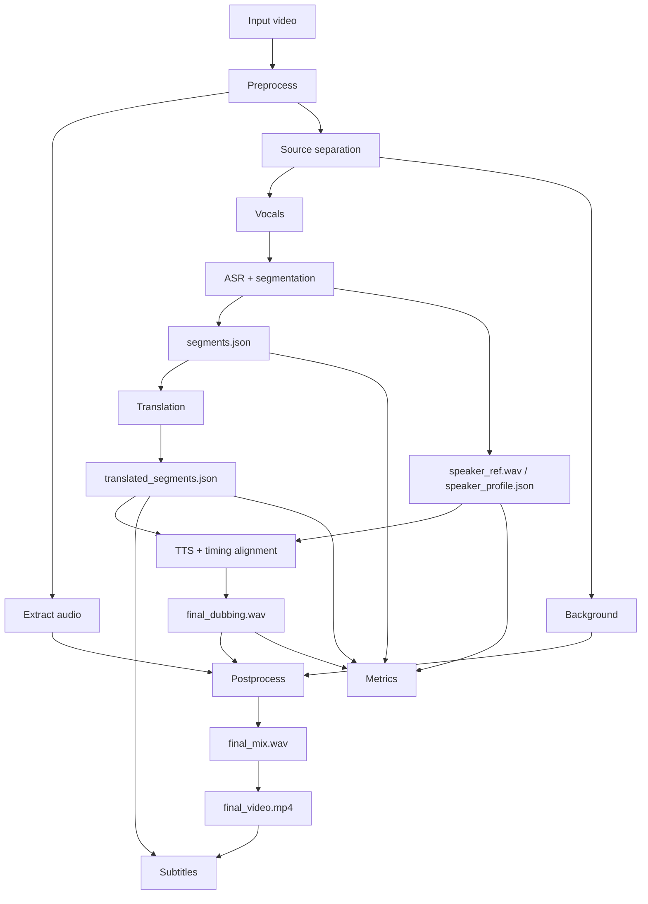

# Automatic Video Dubbing with Voice Identity Preservation

Исследовательский проект по автоматическому дубляжу видео с сохранением голосовой идентичности исходного спикера.

Система обрабатывает одно входное видео, выделяет речь, распознает текст, переводит его на русский язык, синтезирует новую аудиодорожку голосом исходного диктора, собирает финальное видео, генерирует субтитры и считает метрики качества. Кодовая база ориентирована на исследовательскую и дипломную работу, но runtime-артефакты, материалы диплома и тяжелые модели остаются локальными и не попадают в git.

## Что делает проект

- извлекает аудио из видео;
- разделяет речь и фон через `Demucs`;
- распознает речь через `Whisper` или Groq-compatible ASR;
- сохраняет сегменты с таймингами, словами и паузами;
- переводит сегменты через `NLLB` или `Gemini`;
- синтезирует русскую речь через `XTTS-v2`;
- строит `speaker profile` из исходного видео;
- подгоняет тайминг дубляжа под исходные интервалы;
- микширует дубляж с фоновой дорожкой;
- генерирует soft/hard subtitles;
- считает метрики качества: `LaBSE`, `WER`, `CER`, `Speaker Verification`.

## Пайплайн



## Структура репозитория

```text
.
├── main.py                     # точка входа пайплайна
├── config.example.py           # шаблон локальной конфигурации
├── config.py                   # локальная конфигурация, в git не хранится
├── requirements.txt            # Python-зависимости проекта
├── src/
│   ├── preprocessing.py        # ffmpeg + Demucs + аудиоподготовка
│   ├── asr.py                  # ASR, сегментация, speaker profile
│   ├── asr_backend.py          # local/Groq ASR backend
│   ├── translation.py          # NLLB / Gemini и стратегии перевода
│   ├── tts.py                  # XTTS orchestration
│   ├── tts_audio.py            # level matching, compression, peak ceiling
│   ├── tts_guards.py           # tail/babble guards
│   ├── tts_routing.py          # reference routing
│   ├── tts_text.py             # cleanup/grouping
│   ├── tts_timing.py           # timing windows
│   ├── tts_backends.py         # XTTS backend
│   ├── postprocessing.py       # микширование и сборка видео
│   ├── metrics.py              # LaBSE / WER / CER / speaker verification
│   ├── reporting.py            # run_report.md по итогам запуска
│   ├── subtitles.py            # генерация и встраивание субтитров
│   └── finetune.py             # подготовка датасета для XTTS fine-tuning
├── scripts/
│   ├── smoke_pipeline.py       # test-mode smoke-run + artifact validation
│   └── benchmark_tts_profiles.py # сравнение TTS-профилей
├── utils/
│   ├── helpers.py
│   └── pipeline_io.py          # job_name и пути артефактов
├── experiments/                # исследовательские benchmark-скрипты
├── tests/unit/                 # быстрые unit-тесты
└── ENGINEERING_MAP.md          # инженерная карта проекта
```

## Быстрый старт

1. Установить системные зависимости:

```powershell
winget install Gyan.FFmpeg
```

`demucs` устанавливается как Python-пакет из `requirements.txt`, но его CLI должен быть доступен в активном окружении.

2. Подготовить Python-окружение:

```powershell
python -m venv .venv
.\.venv\Scripts\Activate.ps1
python -m pip install -U pip
pip install -r requirements.txt
```

3. Создать локальный конфиг:

```powershell
Copy-Item config.example.py config.py
```

4. Положить XTTS модель в `original_tts_model/`. Минимально ожидаются:

```text
original_tts_model/
  config.json
  model.pth
  vocab.json
  speakers_xtts.pth
```

5. Проверить окружение без запуска тяжелых моделей:

```powershell
python main.py --check-env
```

6. Запустить полный пайплайн:

```powershell
python main.py --video .\data\input\video.mp4 --job-name demo --step all
```

7. Продолжить запуск без пересчета готовых шагов:

```powershell
python main.py --video .\data\input\video.mp4 --job-name demo --step all --resume
```

Если нужно пересчитать конкретный шаг и все последующие:

```powershell
python main.py --video .\data\input\video.mp4 --job-name demo --step all --resume --force-step tts
```

8. Проверить короткий test-mode smoke-run:

```powershell
python scripts\smoke_pipeline.py
```

По умолчанию скрипт ожидает `data/input/smoke_20s.mp4`, запускает `main.py --step all --test --job-name smoke_pipeline`, затем проверяет ключевые артефакты: `final_dubbing.wav`, `final_mix.wav`, `final_video.mp4`, `tts_config.json`, `metrics.json`, `run_report.md`, `translated_segments.json` и `subtitles_manifest.json`.

Чтобы только проверить уже готовые артефакты без повторного запуска:

```powershell
python scripts\smoke_pipeline.py --job-name smoke_pipeline --skip-run
```

## Основные команды

```powershell
python main.py --step preprocess --video .\data\input\video.mp4 --job-name demo
python main.py --step asr --video .\data\input\video.mp4 --job-name demo
python main.py --step translate --video .\data\input\video.mp4 --job-name demo
python main.py --step tts --video .\data\input\video.mp4 --job-name demo
python main.py --step postprocess --video .\data\input\video.mp4 --job-name demo
python main.py --step subtitles --video .\data\input\video.mp4 --job-name demo --subtitle-mode soft
python main.py --step metrics --video .\data\input\video.mp4 --job-name demo
python main.py --step prepare_finetune --video .\data\input\video.mp4 --job-name demo
```

`--test` сохраняет результаты в `data/test/`, production-режим использует `data/output/`.

Если `--video` не указан, пайплайн берет единственное видео из `data/input/`. Старый режим `--suffix` сохранен для совместимости с файлами вида `video_<suffix>.mp4`.

`--resume` пропускает уже готовые шаги по валидным артефактам. Если какой-то шаг пересчитан или указан через `--force-step`, все следующие шаги в `--step all` тоже выполняются, чтобы не оставить устаревшие downstream-файлы.

## Перевод

По умолчанию используется `facebook/nllb-200-distilled-1.3B` и стратегия `per-segment`.

```powershell
python main.py --step translate --video .\data\input\video.mp4 --job-name demo --mt-model facebook/nllb-200-distilled-1.3B --mt-strategy per-segment
```

Для Gemini нужен API key:

```powershell
$env:GEMINI_API_KEY="your_key_here"
python main.py --step translate --video .\data\input\video.mp4 --job-name demo --mt-model gemini-2.5-flash --mt-strategy per-segment
```

Доступные стратегии:

- `per-segment`
- `sentence-level`
- `sliding-window`
- `context-aware`

## Структура результата

Для каждого задания создается отдельная директория:

```text
data/output/<job-name>/
  segments.json
  translated_segments.json
  final_dubbing.wav
  final_mix.wav
  final_video.mp4
  tts_config.json
  metrics.json
  run_report.md
  subtitles/
    subtitles.ass
    subtitles.srt
    subtitles_manifest.json
  temp/
    original_extracted_audio.wav
    vocals.wav
    vocals_processed.wav
    background.wav
    speaker_ref.wav
    speaker_profile.json
    speaker_refs/
    audio_segments/
```

Фактические пути строятся через `utils/pipeline_io.py`.

## Backend-переменные

- `ASR_PROVIDER=local|groq`
- `METRICS_ASR_PROVIDER=local|groq`
- `GROQ_API_KEY=...` для Groq ASR или SmartSync через Groq
- `MT_MODEL_NAME=facebook/nllb-200-distilled-1.3B` или `gemini-*`
- `GEMINI_API_KEY=...` для Gemini-перевода
- `SMART_SYNC_ENABLED=0|1`
- `SMART_SYNC_PROVIDER=groq|gemini`
- `WHISPER_MODEL_NAME=small`

## Оценка качества

Шаг `metrics` сохраняет сводку в `metrics.json`, генерирует человекочитаемый `run_report.md` и считает:

- `LaBSE` - семантическую близость исходного и переведенного текста;
- `WER` - разборчивость синтезированной речи на уровне слов;
- `CER` - разборчивость на уровне символов;
- `Speaker Verification Score` - близость голосовых эмбеддингов.

```powershell
python main.py --step metrics --video .\data\input\video.mp4 --job-name demo
```

Шаг `tts` сохраняет фактический snapshot настроек в `tts_config.json`: XTTS generation, SmartSync, grouping, routing, guards и audio level. Шаг `metrics` копирует этот snapshot в `metrics.json` (`tts_config`), а `run_report.md` показывает краткий verdict, основные метрики, TTS config snapshot, количество сегментов, события TTS grouping/guards, timing pressure и ссылки на ключевые артефакты запуска.

## Эксперименты и тесты

Benchmark-скрипты лежат в `experiments/`:

```powershell
python experiments\compare_translation_strategies.py --suffix smoke_20s
python experiments\compare_translation_models.py --suffix smoke_20s --models nllb-1.3B
python experiments\test_google_translate.py --suffix smoke_20s
python experiments\compare_translator_outputs.py --suffix smoke_20s
python experiments\plot_translation_metrics.py --suffix smoke_20s
```

Быстрые unit-тесты лежат в `tests/unit/`:

```powershell
python -m pytest tests/unit
```

Для GitHub Actions используется минимальный набор зависимостей из `requirements-ci.txt`; тяжелый runtime-стек из `requirements.txt` не нужен для unit-контура.

Smoke-check пайплайна:

```powershell
python scripts\smoke_pipeline.py --video .\data\input\smoke_20s.mp4 --job-name smoke_pipeline
```

Benchmark TTS-профилей на одном коротком видео:

```powershell
python scripts\benchmark_tts_profiles.py --video .\data\input\smoke_20s.mp4 --job-prefix tts_benchmark
```

Скрипт готовит общий upstream job `<prefix>_prep`, затем для каждого профиля копирует одинаковые `segments.json`, `translated_segments.json`, speaker refs и аудио-артефакты, прогоняет `tts -> postprocess -> subtitles -> metrics` и пишет сводки с метриками и фактическим TTS config snapshot:

```text
data/test/<prefix>_summary/tts_benchmark_summary.md
data/test/<prefix>_summary/tts_benchmark_summary.csv
data/test/<prefix>_summary/tts_benchmark_summary.json
```

Доступные профили:

```powershell
python scripts\benchmark_tts_profiles.py --list-profiles
```

Быстрая проверка инфраструктуры без полного сравнения:

```powershell
python scripts\benchmark_tts_profiles.py --video .\data\input\smoke_20s.mp4 --job-prefix smoke_tts_bench --profiles baseline
```

Полный прогон всех профилей нужен как отдельный quality pass перед изменением recommended TTS-настроек.

## Что уже реализовано в TTS-контуре

- multi-reference `speaker profile` из того же видео;
- routing коротких сегментов по reference-клипам;
- grouping соседних сегментов перед TTS;
- ускорение через `ffmpeg atempo`;
- loudness matching;
- cheap tail guard для борьбы с мусорными хвостами;
- optional babble guard и ASR retry;
- кроссфейды и fade-in/fade-out;
- сериализация TTS-таймингов обратно в `translated_segments.json`.

## Примечания по репозиторию

- `data/`, `models/`, `original_tts_model/`, `third_party/`, `articles/`, `thesis/`, `cleanup_archives/` являются локальными артефактами и не должны попадать в git.
- Файлы диплома, статьи, черновики, презентации, `.docx`, `.pdf` и `.pptx` не переносятся в runtime-структуру проекта и остаются вне коммитов.
- Для полного `--step all` нужны тяжелые ML-зависимости и, желательно, CUDA.
