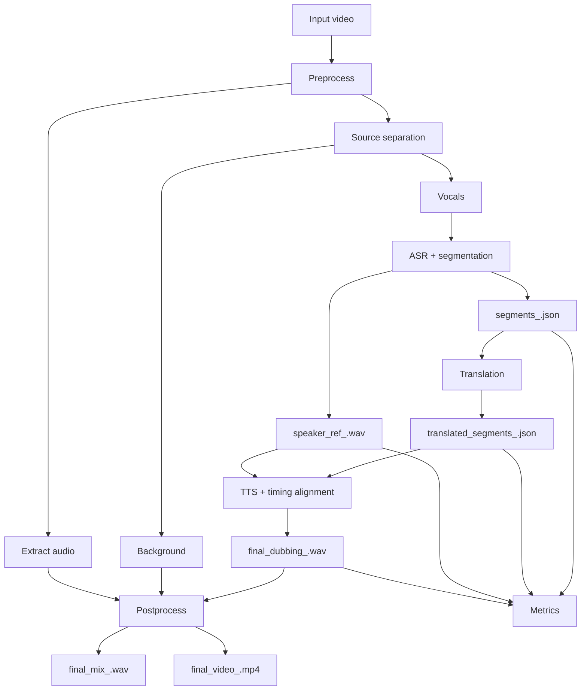

# Automatic Video Dubbing with Voice Identity Preservation

Исследовательский проект по автоматическому дубляжу видео с сохранением голосовой идентичности исходного спикера.

Система обрабатывает одно входное видео, выделяет речь, распознаёт текст, переводит его на русский язык, синтезирует новую аудиодорожку голосом исходного диктора и собирает финальное видео. Текущая кодовая база ориентирована на исследовательскую и дипломную работу, а не на production-упаковку.

## Что делает проект

- извлекает аудио из видео;
- разделяет речь и фон через `Demucs`;
- распознаёт речь через `Whisper`;
- переводит сегменты через `NLLB` или `Gemini`;
- синтезирует русскую речь через `XTTS-v2`;
- автоматически строит `speaker profile` из самого входного видео;
- подгоняет тайминг дубляжа под исходные временные интервалы;
- микширует дубляж с фоновой дорожкой;
- считает метрики качества: `LaBSE`, `WER`, `CER`, `Speaker Verification`.

## Пайплайн



## Структура репозитория

```text
.
├── main.py                     # точка входа пайплайна
├── config.py                   # локальная конфигурация (в .gitignore)
├── src/
│   ├── preprocessing.py        # ffmpeg + Demucs + аудиоподготовка
│   ├── asr.py                  # Whisper, сегментация, speaker profile
│   ├── translation.py          # NLLB / Gemini и стратегии перевода
│   ├── tts.py                  # XTTS, тайминг, routing, tail guards
│   ├── tts_backends.py         # XTTS backend
│   ├── postprocessing.py       # микширование и сборка видео
│   ├── metrics.py              # LaBSE / WER / CER / speaker verification
│   ├── subtitles.py            # генерация субтитров
│   └── finetune.py             # подготовка датасета для XTTS fine-tuning
├── utils/
│   ├── helpers.py
│   └── pipeline_io.py          # job_name и пути артефактов
├── tests/                      # исследовательские скрипты сравнения
├── data/                       # входные/выходные данные и артефакты
├── models/                     # локальные модели
└── ENGINEERING_MAP.md          # инженерная карта проекта
```

## Требования

### Системные зависимости

- `Python 3.10+`  
- `ffmpeg` в `PATH`
- `demucs` в `PATH`
- GPU желательна, но часть шагов может работать на CPU

Проверка:

```powershell
python --version
ffmpeg -version
demucs --help
```

### Python-зависимости

В проекте пока нет зафиксированного `requirements.txt`, поэтому окружение поднимается вручную. Минимальный набор пакетов:

```powershell
pip install torch openai-whisper transformers TTS soundfile pydub noisereduce scipy numpy matplotlib tqdm sentence-transformers scikit-learn jiwer resemblyzer
```

Опционально:

```powershell
pip install googletrans
```

## Конфигурация

`config.py` не хранится в репозитории и считается локальным файлом окружения. В нём задаются:

- пути к `data/input`, `data/output`, `data/test`;
- путь к XTTS-модели;
- параметры `Whisper`, `NLLB`, `XTTS`, микширования и fine-tuning;
- значения по умолчанию для job naming и speaker profile.

Критичные параметры:

- `MODEL_TTS_DIR`
- `INPUT_PATH`
- `OUTPUT_PATH`
- `TEST_OUTPUT_PATH`
- `MT_MODEL_NAME`
- `MT_STRATEGY`

Если используется `Gemini`, требуется переменная окружения:

```powershell
$env:GEMINI_API_KEY="your_key_here"
```

## Быстрый старт

### 1. Подготовить входное видео

Положить ролик в `./data/input/` или передать путь явно через `--video`.

### 2. Запустить весь пайплайн

```powershell
python main.py --step all --video .\data\input\talk.mp4 --job-name talk_ru
```

### 3. Запустить отдельный шаг

```powershell
python main.py --step preprocess --video .\data\input\talk.mp4 --job-name talk_ru
python main.py --step asr --video .\data\input\talk.mp4 --job-name talk_ru
python main.py --step translate --video .\data\input\talk.mp4 --job-name talk_ru
python main.py --step tts --video .\data\input\talk.mp4 --job-name talk_ru
python main.py --step postprocess --video .\data\input\talk.mp4 --job-name talk_ru
python main.py --step metrics --video .\data\input\talk.mp4 --job-name talk_ru
```

### 4. Тестовый режим

Тестовый режим пишет артефакты в `./data/test/`, не затрагивая production-результаты.

```powershell
python main.py --step all --video .\data\input\talk.mp4 --job-name talk_ru --test
```

## Перевод

Поддерживаются несколько backend- и strategy-вариантов.

### NLLB

По умолчанию:

```powershell
python main.py --step translate --video .\data\input\talk.mp4 --mt-model facebook/nllb-200-distilled-1.3B --mt-strategy per-segment
```

### Gemini

```powershell
python main.py --step translate --video .\data\input\talk.mp4 --mt-model gemini-2.5-flash --mt-strategy per-segment
```

### Доступные стратегии

- `per-segment`
- `sentence-level`
- `sliding-window`
- `context-aware`

## Выходные файлы

Для `job_name=<job>` пайплайн создаёт:

```text
data/output/
├── segments_<job>.json
├── translated_segments_<job>.json
├── metrics_summary_<job>.json        # через metrics step
├── final_dubbing_<job>.wav
├── final_mix_<job>.wav
├── final_video_<job>.mp4
└── temp/
    ├── original_extracted_audio_<job>.wav
    ├── vocals_<job>.wav
    ├── vocals_processed_<job>.wav
    ├── background_<job>.wav
    ├── speaker_ref_<job>.wav
    └── speaker_profile_<job>.json
```

Фактические имена и директории строятся через `utils/pipeline_io.py`.

## Оценка качества

Проект считает следующие метрики:

- `LaBSE` — семантическая близость перевода;
- `WER` — разборчивость синтезированной речи на уровне слов;
- `CER` — разборчивость на уровне символов;
- `Speaker Verification Score` — близость голосовых эмбеддингов.

Шаг:

```powershell
python main.py --step metrics --video .\data\input\talk.mp4 --job-name talk_ru
```

## Исследовательские скрипты

Скрипты в `tests/` — это не unit tests, а экспериментальные утилиты:

- `tests/test_translation.py` — сравнение стратегий перевода;
- `tests/test_translation_models.py` — сравнение моделей перевода;
- `tests/test_google_translate.py` — baseline с Google Translate;
- `tests/plot_translation_metrics.py` — построение графиков;
- `tests/compare_translator_outputs.py` — сравнение итоговых выходов переводчиков.

## Что уже реализовано в TTS-контуре

- multi-reference `speaker profile` из того же видео;
- routing коротких сегментов по reference-клипам;
- grouping соседних сегментов перед TTS;
- ускорение через `ffmpeg atempo`;
- loudness matching;
- `cheap tail guard` для борьбы с мусорными хвостами;
- optional `babble guard` и `ASR retry`;
- кроссфейды и fade-in/fade-out.


